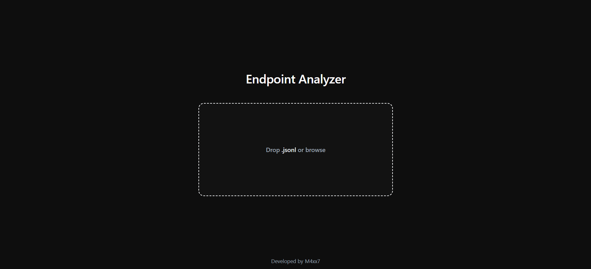
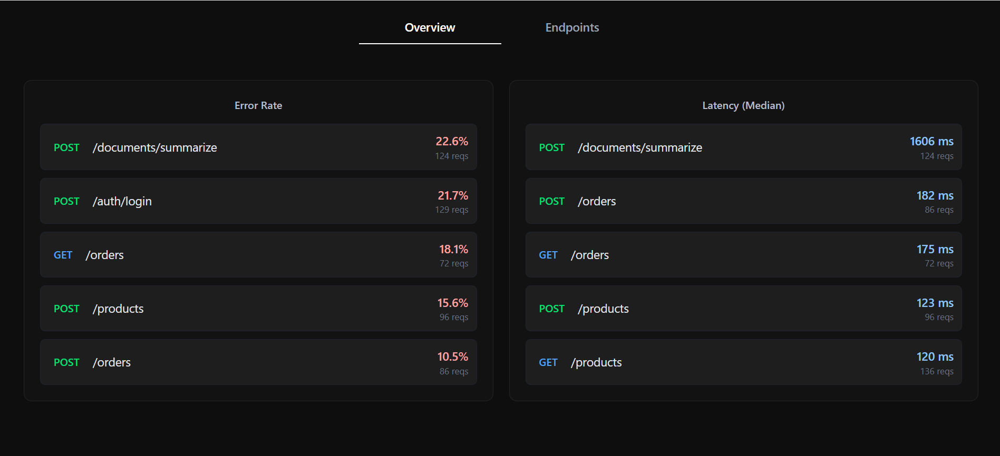
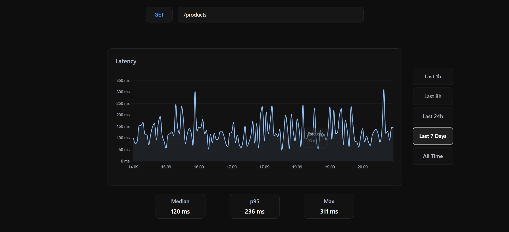
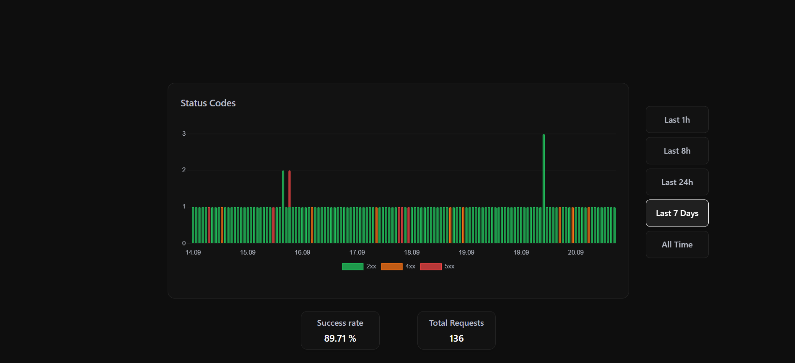

# Endpoint Analyzer

A full-stack web application for analyzing JSON-formatted API logs and visualizing key performance metrics and health insights.


## Live Application

- **Frontend (Vercel):** [Endpoint Analyzer Web](https://endpoint-analyzer.vercel.app)
- **Backend API (Railway):** Node.js & Express REST API handling log parsing and aggregation.


## Expected Log Format

The backend analysis engine processes line-delimited JSON (`.jsonl`) files. Each line must be a valid JSON object containing at least the required telemetry fields (`timestamp`,`method`, `path`, `status`, and `duration`):

```json
{"timestamp":"2026-09-20T17:10:06Z","method":"GET","path":"/health","status":200,"duration":16}

## Features

- **Endpoint Success Rate**  
  Highlights the least successful endpoints based on error rates and failure counts.
- **Latency**  
  Median, P95, and Maximum latency metrics for specific endpoints.
- **Status Code Distribution**  
   Charts tracking the distribution of response categories (2xx, 3xx, 4xx, and 5xx).


## Screenshots





